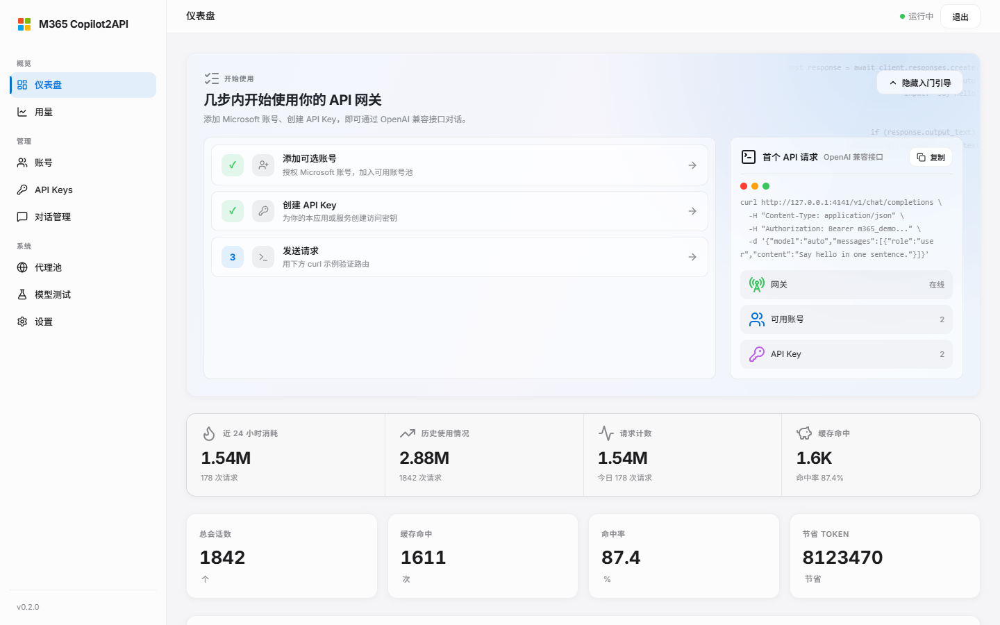
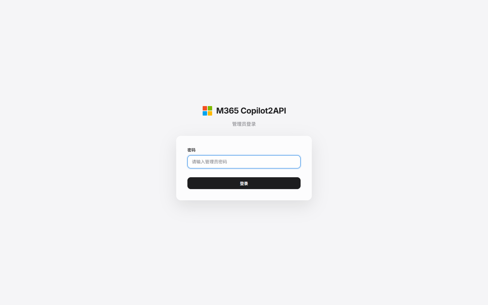
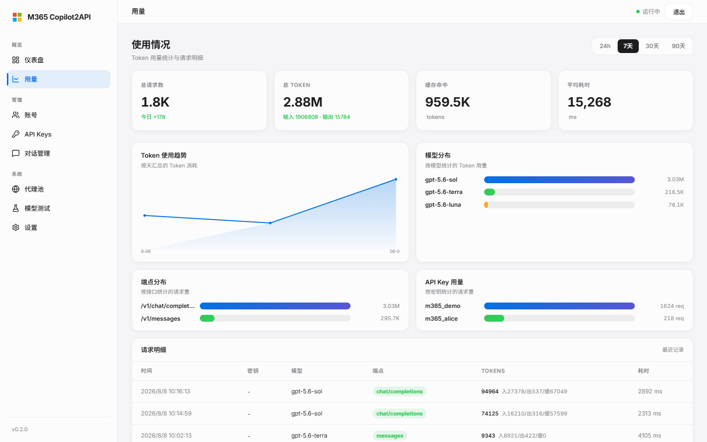
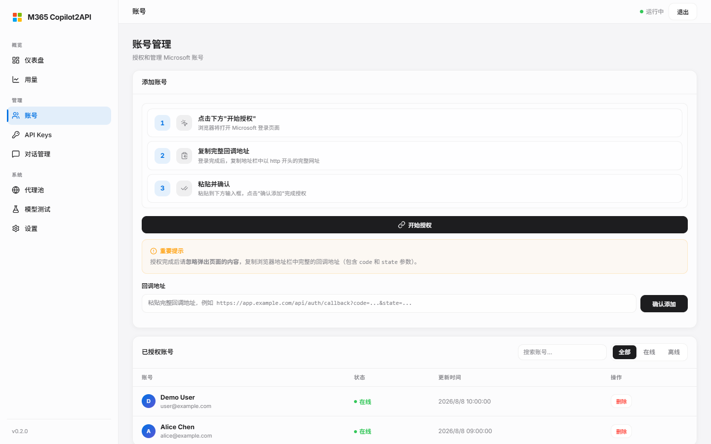
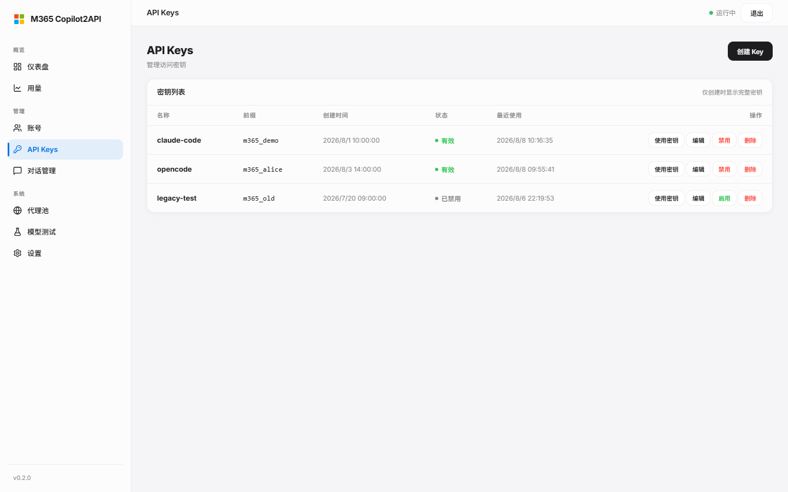
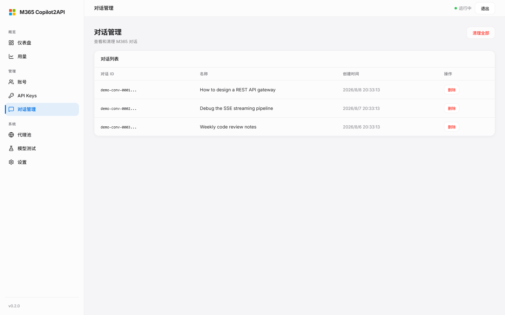
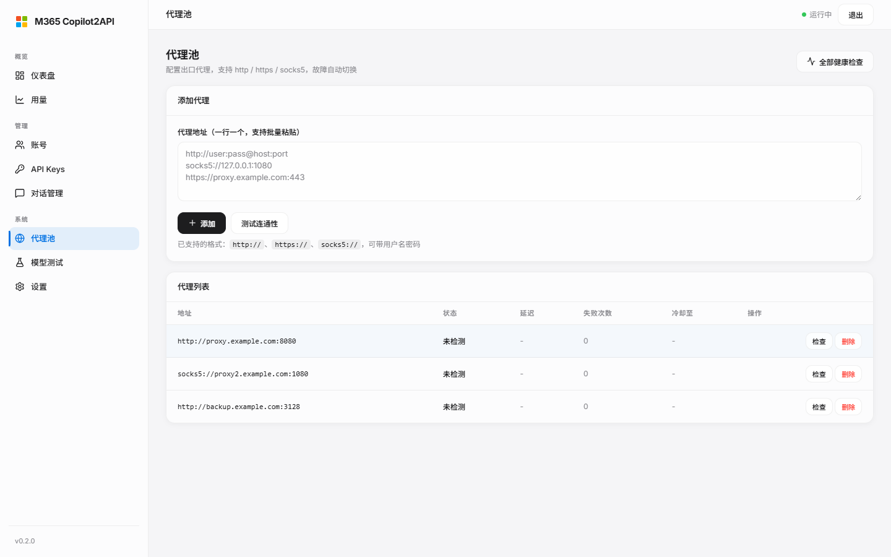
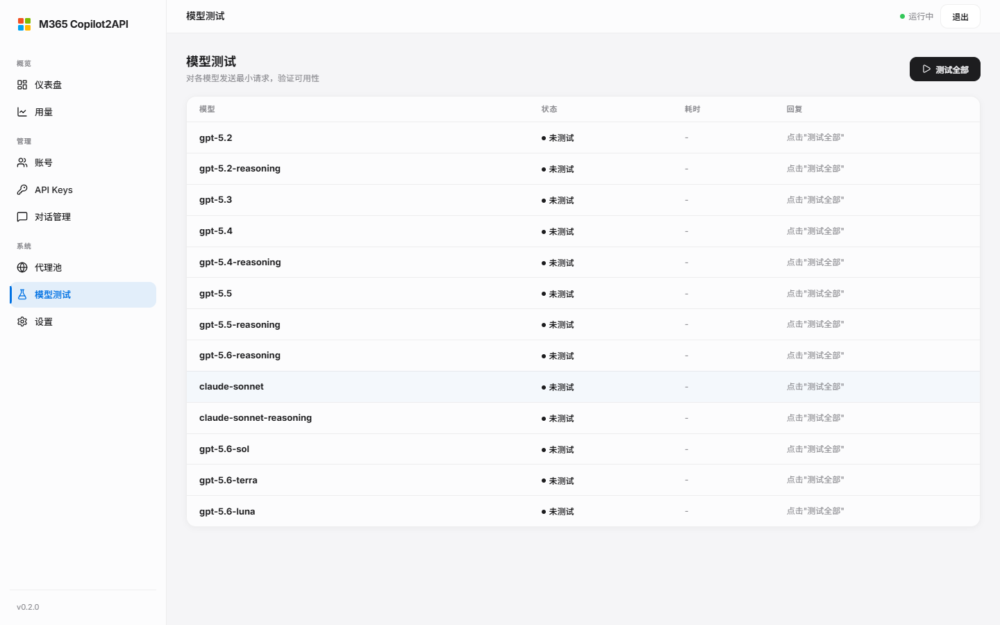
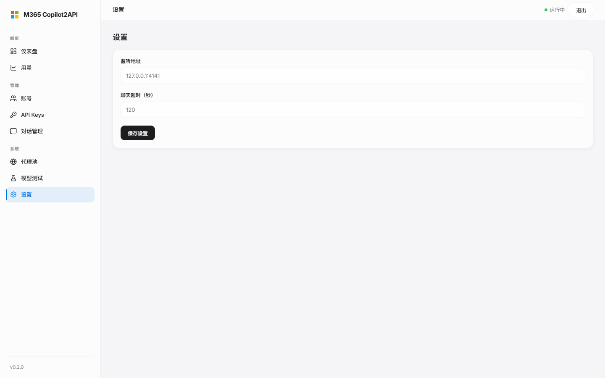

# M365 Copilot2API

<p align="center">
  
  
  
  
</p>

<p align="center">
  <strong>Microsoft 365 Copilot → OpenAI / Anthropic-Compatible API Gateway</strong>
</p>

M365 Copilot2API is a self-hosted gateway written in Go that translates the **ChatHub private protocol** (WebSocket) behind Microsoft 365 Copilot commercial subscriptions into standard **OpenAI / Anthropic-compatible APIs**. Claude Code, OpenCode, Cursor, and any OpenAI client can call M365 Copilot using familiar API formats.

In short: **ChatHub private protocol ⇄ OpenAI / Anthropic-compatible API**. Connection handshakes, keep-alive heartbeats, event-stream parsing, and tool-call conversion are encapsulated in `internal/chathub`; only standard endpoints such as `/v1/chat/completions` and `/v1/messages` are exposed externally.

The project includes a complete web administration console with account authorization (OAuth/PKCE), API key management, proxy pools, cloud conversation management, usage statistics, and model testing. It is intended for personal self-hosted deployments.

> ⚠️ **Disclaimer (please read)**
>
> - This project is **not an official Microsoft product** and has no affiliation or partnership with Microsoft, OpenAI, Anthropic, or their affiliates.
> - Using third-party account pools or proxy forwarding to access M365 services **may violate the service provider's terms of service**. You are solely responsible for any consequences.
> - Follow all applicable laws and the terms of service of the target platform.
> - This project is **for personal learning and research only**. **Commercial resale and large-scale operation are prohibited.**
> - The maintainers and contributors are not responsible for account bans, data loss, or any other damages.

## Interface Preview

<p align="center"></p>

<table>
  <tr>
    <td align="center" width="33%"><br><sub><b>Login</b></sub></td>
    <td align="center" width="33%"><br><sub><b>Usage</b></sub></td>
    <td align="center" width="33%"><br><sub><b>Accounts</b></sub></td>
  </tr>
  <tr>
    <td align="center" width="33%"><br><sub><b>API Keys</b></sub></td>
    <td align="center" width="33%"><br><sub><b>Conversations</b></sub></td>
    <td align="center" width="33%"><br><sub><b>Proxy Pool</b></sub></td>
  </tr>
  <tr>
    <td align="center" width="33%"><br><sub><b>Model Test</b></sub></td>
    <td align="center" width="33%"><br><sub><b>Settings</b></sub></td>
    <td align="center" width="33%"><sub><i>More features waiting to be discovered</i></sub></td>
  </tr>
</table>

## Features

| Feature | Description |
|------|------|
| OpenAI-compatible `/v1/chat/completions` | Streaming output and function calling |
| OpenAI Responses `/v1/responses` | Responses protocol compatibility (including Codex clients) |
| Anthropic-compatible `/v1/messages` | Direct access from Claude Code / Cursor |
| SSE streaming | Real-time incremental output with `stream: true` |
| Tool-call conversion | OpenAI function calling ⇄ M365 tool protocol, with `router` and `native` planning modes |
| Content-key session reuse | Reuses cloud conversations by context; only incremental messages are sent on a hit, similar to DeepSeek context caching |
| Explicit session binding | Use the `X-M365-Session-Id` header to select the exact session to continue |
| Automatic cleanup | Reclaims cloud conversations by idle time (2 hours by default) or retention count |
| Multi-account management | PKCE authorization, account rotation, and automatic failover |
| API key management | Create, revoke, and read keys from the console |
| Proxy pool | HTTP / HTTPS / SOCKS5 rotation, health checks, and failure cooldowns |
| Usage statistics | Aggregate by key, account, model, and endpoint (`usage.jsonl`) |
| Cache-hit statistics | Dashboard for hit rate and saved tokens |
| Multimodal input | Image and other attachments via base64 data URLs / HTTPS URLs; automatic M365 upload and message annotation |
| Image generation | `/v1/images/generations` |
| Web console | Manage accounts, keys, proxies, models, conversations, and logs in one place |

## Architecture

```
┌──────────────┐    OpenAI / Anthropic    ┌──────────────────┐    ChatHub    ┌──────────────┐
│ Claude Code  │ ───────────────────────► │      Gateway     │ ────────────► │ M365 Copilot │
│ OpenCode     │   /v1/chat/completions   │ (Go, m365-copilot2api) │ WebSocket  │ (cloud chat) │
│ Any OpenAI   │   /v1/messages           │  internal/web    │  internal/   │              │
│ client       │   /v1/responses          │                  │  chathub     │              │
└──────────────┘                          └──────────────────┘              └──────────────┘
```

- **Protocol layer (`internal/chathub`)**: Encapsulates the M365 Copilot ChatHub private WebSocket protocol, including connection setup, heartbeats, event-stream parsing (streaming tokens, tool calls, and multimodal input). It exposes a unified event interface to higher layers.
- **Session resolution (`internal/web/session_resolver.go`)**: In multi-account deployments, consistently maps each client request to an account and cloud conversation, while implementing content-key session reuse.
- **Account rotation and failover**: Balances traffic across multiple accounts and automatically retries with the next available account when authentication or connection failures occur.

## Quick Start

### Requirements

- Go 1.23+ (the minimum version declared in `go.mod`)
- Windows or Linux; on Windows, the included `manage.py` is recommended for process management

### Build from source

```powershell
git clone https://github.com/HEXUXIU/M365-Copilot2API.git
cd M365-Copilot2API

# Set the administrator password (optional; defaults to admin123). Always use a strong password in production.
$env:M365_ADMIN_PASSWORD = "your_strong_password"

go build -o m365-copilot2api.exe ./cmd/server
```

```bash
# Linux / macOS
export M365_ADMIN_PASSWORD=your_strong_password
go build -o m365-copilot2api ./cmd/server
```

### Start

On Windows, use `manage.py` (runs in the background by default and writes to `server.log` / `server-error.log`):

```powershell
python manage.py start    # Run in the background; listens on 0.0.0.0:4141 by default
python manage.py status   # Show process status
python manage.py logs     # Show recent logs; optionally pass N for the number of lines
python manage.py err      # Show the error log
python manage.py stop     # Stop the service
```

> `manage.py` contains hard-coded absolute paths such as `D:\M365-Copilot2API\m365-copilot2api.exe`. If you cloned the repository elsewhere, update the path constants at the top of the script and build the binary first.

When running the binary directly, it listens only on `http://127.0.0.1:4141` by default. Override this with the `M365_LISTEN` environment variable.

### Docker deployment

The repository includes a `Dockerfile` and `docker-compose.yml`:

```bash
docker compose up -d --build
```

The image runs as a non-root user. The default port mapping exposes the service only on `127.0.0.1`, data is mounted at `./data`, and the administrator password can be injected through a file.

### Initialization and first request

Open the console in a browser (by default, `http://127.0.0.1:4141`):

1. Log in with the administrator password. On first login, you **must change the password**.
2. On the **Accounts** page, start **PKCE authorization** and complete the M365 sign-in flow.
3. After authorization succeeds, create your first API key on the **API Keys** page.
4. Verify the connection using one of the API examples below.

> If you have multiple M365 accounts, repeat the authorization process. The gateway will automatically schedule them using rotation and failover.

## Configuration

Configuration is provided through environment variables. You can use `.env.example` as a starting point. Explicitly set environment variables take priority when the application starts.

### Core

| Variable | Default | Description |
|------|------|------|
| `M365_LISTEN` | `127.0.0.1:4141` | Listen address (`manage.py` and Docker use `0.0.0.0:4141` internally) |
| `M365_ADMIN_PASSWORD` | `admin123` | Administrator password; the first login requires a password change |
| `M365_DATA_DIR` | `~/.config/m365-copilot2api` | Data directory for tokens, keys, usage data, and other state; `manage.py` uses `data/` |
| `M365_CONFIG` | `~/.config/m365-copilot2api/accounts.json` | Account configuration file |
| `M365_SESSION_TTL_MINUTES` | `120` | Session binding lifetime in minutes; expired bindings are removed from `sessions.json` |
| `M365_CONTEXT_TTL_MINUTES` | `120` | Context-fingerprint reuse window in minutes |
| `M365_CONTEXT_SIMILARITY` | `0.6` | Context-similarity reuse threshold (0–1, Jaccard similarity) |
| `M365_LOG_LEVEL` | `info` | Log level |

### Automatic cleanup

Cloud conversations are treated as cache entries: a session hit refreshes its lifetime, while idle or excess conversations are reclaimed by a background loop.

| Variable | Default | Description |
|------|------|------|
| `M365_AUTO_CLEANUP` | Enabled | Cloud-conversation cleanup; set to `0` / `false` / `no` / `off` to disable |
| `M365_AUTO_CLEANUP_INTERVAL_MINUTES` | `30` | Scan interval in minutes |
| `M365_AUTO_CLEANUP_MAX_AGE_HOURS` | `2` | Reclaim conversations idle for longer than this many hours |
| `M365_AUTO_CLEANUP_KEEP_N` | `100` | Maximum number of cloud conversations to retain |

| Variable | Default | Description |
|------|------|------|
| `M365_CLEANUP_MODE` | `after_response` | Local conversation-index cleanup mode: `after_response` / `keep_n` / `max_age` |
| `M365_CLEANUP_KEEP_N` | `5` | Number to retain in `keep_n` mode |
| `M365_CLEANUP_MAX_AGE_HOURS` | `24` | Age limit in `max_age` mode |

### Tools and reasoning

| Variable | Default | Description |
|------|------|------|
| `M365_TOOL_PLANNING_MODE` | `router` | Tool-planning mode: `router` (gateway routing) / `native` (cloud-native planning) |
| `M365_MAX_TOOL_CALLS_PER_TURN` | `1` | Maximum parallel tool calls per turn; side-effecting operations are automatically serialized |
| `M365_MAX_TOOL_ROUNDS` | `16` | Maximum tool rounds per request |
| `M365_CONTEXT_WINDOW` | `128000` | Context window |
| `M365_MAX_OUTPUT_TOKENS` | `16384` | Maximum output tokens |
| `M365_CHAT_TIMEOUT_SECONDS` | `120` | Chat timeout in seconds |
| `M365_IMAGE_TIMEOUT_SECONDS` | `150` | Image-processing timeout in seconds |

### Proxy pool and authentication

| Variable | Default | Description |
|------|------|------|
| `M365_PROXY_POOL` | Empty | Proxy list, separated by commas or newlines; supports HTTP / HTTPS / SOCKS5 |
| `M365_PROXY_INSECURE_TLS` | — | Trust self-signed proxy certificates (`1` / `true`) |
| `M365_PROXY_HEALTH_URL` | Built-in probe URL | Target URL used for proxy health checks |
| `M365_CLIENT_ID` | Built-in | Azure application client ID |
| `M365_AUTHORITY` / `M365_REDIRECT_URI` / `M365_SCOPE` | Built-in | Overrides for OAuth endpoints |

### Web search

| Variable | Default | Description |
|------|------|------|
| `M365_ENABLE_WEB_SEARCH` | on | Automatically injects the `web_search` declaration (`0` / `false` / `off` disables it). When enabled, every conversation registers the BingWebSearch built-in plugin like the M365 web app, so models can answer from live search results |

> Note: `web_search` is a server-side built-in tool (`BingWebSearch`) and never appears in the `tool_calls` sent to clients; results surface in the reply stream as `SearchResults` references. If a client declares `web_search` itself (type or function name), the gateway does not re-inject it.

### Data files

| Variable | Description |
|------|------|
| `M365_TOKEN_CACHE` | Token cache file; defaults to the data directory when unset |
| `M365_SESSION_CACHE` | Session-binding cache file; defaults to `sessions.json` |
| `M365_CONVERSATION_CACHE` | Local conversation index; defaults to `conversations.json` |
| `M365_API_KEYS` | API key storage file |
| `M365_USAGE_LOG` | Usage log; defaults to `{data_dir}/usage.jsonl` |
| `M365_DEBUG_LOG` | Debug log containing request/response metadata |

## Usage Examples

### Basic chat (OpenAI format)

```bash
curl http://127.0.0.1:4141/v1/chat/completions \
  -H "Authorization: Bearer YOUR_API_KEY" \
  -H "Content-Type: application/json" \
  -d '{
    "model": "gpt-5.6-sol",
    "messages": [{"role": "user", "content": "Hello"}]
  }'
```

### Streaming output

```bash
curl http://127.0.0.1:4141/v1/chat/completions \
  -H "Authorization: Bearer YOUR_API_KEY" \
  -H "Content-Type: application/json" \
  -d '{
    "model": "gpt-5.6-sol",
    "messages": [{"role": "user", "content": "What is 1+1?"}],
    "stream": true
  }'
```

### Explicit session selection (content-key reuse and incremental requests)

Requests carrying the same `X-M365-Session-Id` are bound to the same cloud conversation. On a cache hit, the gateway sends only newly added history to the upstream service:

```bash
curl http://127.0.0.1:4141/v1/chat/completions \
  -H "Authorization: Bearer YOUR_API_KEY" \
  -H "Content-Type: application/json" \
  -H "X-M365-Session-Id: my-project-session" \
  -d '{"model":"gpt-5.6-sol","messages":[{"role":"user","content":"Continue our previous discussion"}]}'
```

### Multimodal image input (OpenAI format)

Clients can send images using the standard OpenAI `image_url` format. The gateway automatically uploads the image to M365's `UploadFile` endpoint and injects the file annotation into the ChatHub message; the client does not need to know about the upstream details.

```bash
# Data URL with base64
curl http://127.0.0.1:4141/v1/chat/completions \
  -H "Authorization: Bearer YOUR_API_KEY" \
  -H "Content-Type: application/json" \
  -d '{
    "model": "gpt-5.6-sol",
    "messages": [{
      "role": "user",
      "content": [
        {"type": "text", "text": "What colors are visible in this image?"},
        {"type": "image_url", "image_url": {"url": "data:image/png;base64,iVBORw0KGgoAAAANSUhEUgAAAAEAAAAB..."}}
      ]
    }]
  }'
```

You can also provide an HTTPS image URL (public URLs only, with SSRF protection). Use a data URL for local images. The Responses protocol also supports `input_image` and `input_file`.

### Anthropic format (Claude Code / Cursor)

```bash
curl http://127.0.0.1:4141/v1/messages \
  -H "x-api-key: YOUR_API_KEY" \
  -H "anthropic-version: 2023-06-01" \
  -H "Content-Type: application/json" \
  -d '{"model":"gpt-5.6-sol","max_tokens":1024,"messages":[{"role":"user","content":"Hello"}]}'
```

Reasoning content returned by the upstream service (Chain of Thought) is mapped to Anthropic `thinking` blocks and can be displayed and used by Claude Code.

## Claude Code Integration

Point `~/.claude/settings.json` at the gateway under `env`:

```json
{
  "env": {
    "ANTHROPIC_BASE_URL": "http://127.0.0.1:4141",
    "ANTHROPIC_MODEL": "gpt-5.6-sol",
    "ANTHROPIC_API_KEY": "m365_your_key"
  }
}
```

The same approach works with any client that supports an OpenAI / Anthropic `base_url` setting, including OpenCode, Cursor, and Codex: point `BASE_URL` at the gateway.

The **Use API key** dialog on the console's **API Keys** page can generate a Claude Code `settings.json` configuration and terminal environment variables for you to copy.

> ⚠️ **Authentication conflict warning**: If a system-level `ANTHROPIC_API_KEY` or `ANTHROPIC_AUTH_TOKEN` remains set, Claude Code may warn that authentication might not work. Keep one authentication method: allow `settings.json` to override the system variable, or remove the leftover system-level `ANTHROPIC_*` variables.

## Available Models

网关实际内置 13 个模型（`gatewayModels` + 默认映射，以 `/v1/models` 目录为准；可在控制台「设置」页增删映射、调整默认推理级别）：

| Model | Default reasoning level | Description |
|------|-------------|------|
| `gpt-5.6-sol` | `low` | 默认模型（可配置映射） |
| `gpt-5.6-terra` | `medium` | 推理折中（可配置映射） |
| `gpt-5.6-luna` | `medium` | 推理折中（可配置映射） |
| `gpt-5.6-reasoning` | — | 内置模型 |
| `gpt-5.5` / `gpt-5.5-reasoning` | — | 内置模型 |
| `gpt-5.4` / `gpt-5.4-reasoning` | — | 内置模型 |
| `gpt-5.3` | — | 内置模型 |
| `gpt-5.2` / `gpt-5.2-reasoning` | — | 内置模型 |
| `claude-sonnet` / `claude-sonnet-reasoning` | — | 内置模型（Anthropic via M365） |

- 模型映射把公开模型名翻译成上游 tone；控制台可增删映射、调整默认推理级别。
- 推理强度还可通过请求内的 `reasoning_effort` 参数调整。
- 内置模型来自 `internal/web/codex_catalog.go`（`gatewayModels`），可配置映射来自 `internal/web/settings.go`（`defaultModelMappings`）；M365 订阅上线的新模型（如 `codex` 系）以实际目录为准，可在控制台配置导入。

## How Content-Key Session Reuse Works

In multi-account deployments, the gateway uses a **context key** to reuse existing cloud conversations. This is similar to DeepSeek-style context caching: **one cloud session is maintained for a given conversation context, and only new messages are sent upstream on a hit**. This avoids rebuilding context and provides a better multi-turn tool-calling experience. The core implementation is in `internal/web/session_resolver.go`.

When a client request arrives, `.Resolve()` chooses a session in the following priority order:

1. **Explicit session (`X-M365-Session-Id`)**: The session ID supplied by the request header has the highest priority. It is not subject to identity checks; the caller explicitly chooses which cloud conversation to continue.
2. **Content-key prefix hit**: If the request message sequence exactly matches the history prefix of a recorded session (the content fingerprint is calculated from the latest three messages), the gateway reuses that session and cloud conversation. `HistoryLen` indicates how many messages are already present upstream, so the higher layer sends only `messages[HistoryLen:]`.
3. **Similarity fallback**: If the messages are not an exact prefix but their similarity to the last message of a recently active session exceeds `M365_CONTEXT_SIMILARITY` (default `0.6`) within the `M365_CONTEXT_TTL_MINUTES` window, the session is reused. Because the incremental boundary is unknown in this case, the full request is sent.
4. **Create a new session**: If nothing matches, the gateway creates a new session using the `user` field, an IP+UA fingerprint, or account rotation.

This mechanism provides:

- **Reuse across IPs and accounts**: The content fingerprint is a globally unique key and does not depend on the caller. A client can continue the same cloud conversation from another machine or account as long as the context matches.
- **Incremental requests**: Exact prefix hits send only newly added messages, treating the cloud conversation as a context cache.
- **Session and cleanup integration**: Session bindings are persisted in `sessions.json` with mode `0600`. Expiration is controlled by `M365_SESSION_TTL_MINUTES`; sessions that are not hit for a long time are reclaimed by automatic cleanup using the same default two-hour window.

## Automatic Conversation Cleanup

Cloud conversations are treated as cache entries: **a session hit refreshes the lifetime; idle time causes expiration**. The background loop runs every 30 minutes by default and reclaims:

- Cloud conversations idle longer than `M365_AUTO_CLEANUP_MAX_AGE_HOURS` (default: 2 hours), or
- The oldest conversations beyond `M365_AUTO_CLEANUP_KEEP_N` (default: 100).

**The following conversations are never reclaimed**: whitelisted conversations, conversations referenced by active session bindings, and recently used user sessions. Deleting a cloud conversation also removes its local index and session binding, preventing stale sessions from being reused and avoiding cross-session or error conditions. See `internal/web/auto_cleanup.go` for details.

## API Endpoint Reference

### Public-compatible endpoints (`/v1/*`)

| Endpoint | Method | Description |
|------|------|------|
| `/v1/models` | GET | Model catalog |
| `/v1/chat/completions` | POST | Chat completions with streaming and tool calls |
| `/v1/responses` | POST | OpenAI Responses protocol |
| `/v1/messages` | POST | Anthropic Messages; requires `x-api-key` and `anthropic-version` |
| `/v1/images/generations` | POST | Image generation |
| `/v1/sessions` | GET / POST | Query session bindings or query/create by `session_id` |
| `/v1/sessions/{id}` | DELETE | Remove a session binding |

### Administration API (`/api/*`, requires an administrator session)

| Endpoint | Description |
|------|------|
| `/api/admin/login` · `/logout` · `/session` | Administrator session management |
| `/api/admin/change-password` | Change the administrator password; required on first login |
| `/api/admin/keys` | Create, revoke, and read API keys |
| `/api/admin/models` · `/models/test` | Model catalog and single-model connectivity test; does not depend on a plaintext key |
| `/api/admin/settings` | View and update runtime settings |
| `/api/admin/proxy-pool` | Proxy pool management |
| `/api/accounts` · `/refresh` · `/delete` | Account management |
| `/api/auth/start` · `status` · `callback` | PKCE authorization flow |
| `/api/conversations` · `/api/m365/conversations` | List, delete, clean up, and whitelist local/cloud conversations |
| `/api/stats` · `/stats/reset` | Cache-hit statistics |
| `/api/usage` · `/usage/logs` | Usage dashboard and detailed records |
| `/api/chat` · `/chat/stream` | Interactive chat from the console |
| `/api/health` · `/api/version` | Health check and version information |

## Testing

The repository includes unit tests covering session resolution, automatic cleanup, tool routing, protocol compatibility, usage statistics, and more:

```bash
go test ./...
```

Examples include verifying the default two-hour automatic cleanup window (`internal/web/auto_cleanup_test.go`), incremental sending after a content-key prefix hit (`session_resolver_test.go`), and Responses / Anthropic protocol event sequences.

## Directory Structure

```
M365-Copilot2API/
├── cmd/server/            # HTTP server entry point
├── internal/
│   ├── web/               # HTTP routes, session resolver, cleanup, admin API, usage statistics
│   │   ├── session_resolver.go   # Content-key session reuse (four fingerprints)
│   │   ├── auto_cleanup.go        # Automatic cloud-conversation cleanup
│   │   ├── usage.go               # usage.jsonl statistics
│   │   └── ...                    # Tool calls, protocol conversion, proxy pool, key management, etc.
│   ├── chathub/           # M365 Copilot ChatHub WebSocket client
│   ├── auth/              # OAuth / PKCE
│   ├── mcp/               # MCP tool gateway (SSE / JSON-RPC)
│   └── outbound/          # HTTP proxy pool
├── web/                   # Administration console (single-page HTML / JS)
├── scripts/               # Operations and diagnostic scripts
│   ├── e2e_test.py        # End-to-end tests
│   ├── chathub_probe.py   # ChatHub protocol probe
│   ├── genprobe.py        # Image-generation protocol probe (raw frame dump)
│   ├── multimodal_probe.py # Multimodal image-input probe (upload and annotation flow)
│   ├── test-recorder.ps1  # Windows test recorder
│   └── m365-upload-forensic-trace.user.js  # Upload forensic-trace script
├── docs/screenshots/      # Interface screenshots
├── manage.py              # Process management: start / stop / status / logs / err
├── docker-compose.yml · Dockerfile
└── data/                  # Runtime data, configured through M365_DATA_DIR
```

## Security Notes

- **Local binding by default**: The binary listens on `M365_LISTEN=127.0.0.1:4141` by default. If you expose it externally, always use a TLS-terminating reverse proxy such as Nginx or Caddy, enable long-lived SSE and WebSocket connections, and set `proxy_buffering off`.
- **Password change on first login**: After using the default or bootstrap password for the first login, you must change the administrator password.
- **Minimize key exposure**: API keys can be read back from the console after creation; protect access to the administration console.
- **File permissions**: Account credentials, token caches, session bindings, and API keys are written with `0600` permissions. The data directory should use `0700`. Back up the data directory regularly.

## FAQ

**Q1: Why are the number of cloud conversations increasing?**

The background cleanup runs every 30 minutes. It reclaims cloud conversations idle for more than two hours (`M365_AUTO_CLEANUP_MAX_AGE_HOURS`, default `2`) or beyond the retention limit (`M365_AUTO_CLEANUP_KEEP_N`, default `100`). Conversations referenced by active sessions or included in the whitelist are never reclaimed. Lower these values for more aggressive cleanup. Set `M365_AUTO_CLEANUP=0` to disable cleanup (not recommended; cloud conversations will grow indefinitely and may trigger risk controls).

**Q2: How do I switch M365 accounts?**

You do not need to switch manually. With multiple accounts, the gateway automatically rotates through all available accounts and fails over when one account fails. To add an account, start another PKCE authorization flow from the console.

**Q3: Claude Code says that authentication may not work. What should I do?**

This is usually caused by a leftover system-level `ANTHROPIC_API_KEY` or by setting both `ANTHROPIC_API_KEY` and `ANTHROPIC_AUTH_TOKEN`. Keep only `ANTHROPIC_API_KEY` in `~/.claude/settings.json` (the settings file overrides system variables) and remove leftover system-level `ANTHROPIC_*` variables.

**Q4: What is `X-M365-Session-Id`?**

The gateway normally reuses sessions automatically based on context prefixes and similarity. When you need client-side control over the mapping between a client session and a cloud conversation, send the `X-M365-Session-Id` header. The gateway binds directly to that ID and does not use local content fingerprints for priority resolution.

**Q5: Conversations are mixed up or the context is incorrect. What should I do?**

Session bindings are automatically removed after they expire. If local and cloud caches become out of sync, manually delete the cloud conversation from the **Conversations** page. The gateway will also remove the local binding and rebuild it on the next request.

## Contributing

Pull requests are welcome. Before submitting:

1. Fork the repository and create a dedicated branch. Keep each pull request focused on one issue.
2. Never commit credentials, cookies, account caches, logs, or build artifacts.
3. Run `gofmt -w` after changing Go files. Before submitting, run `go test ./...`, `go vet ./...`, and `go build ./...`.
4. Describe behavior changes and include tests for new logic.

See [CONTRIBUTING.md](CONTRIBUTING.md) for details.

## License

[MIT License](LICENSE).
